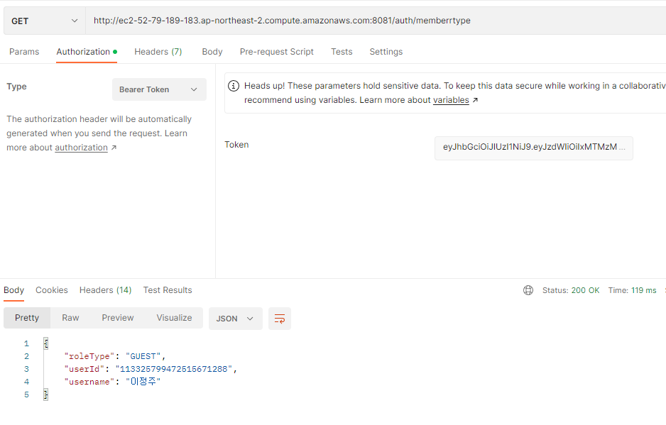
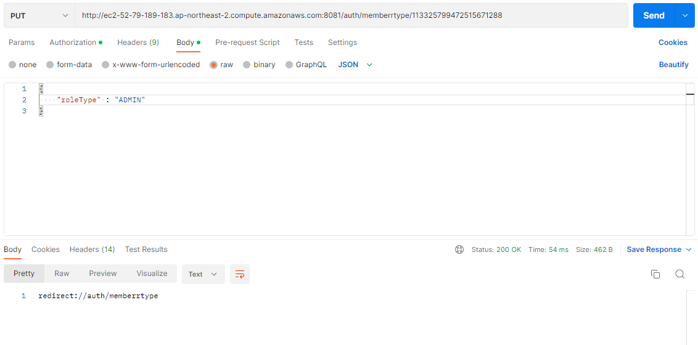
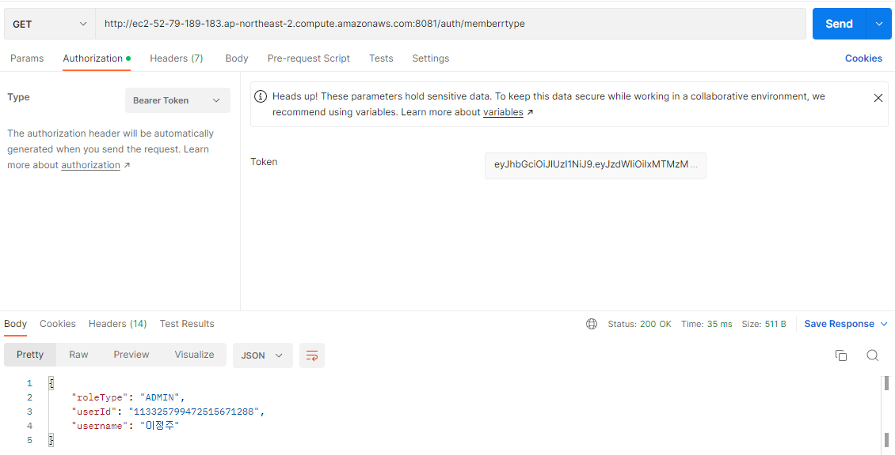

# NovaHomepageBackend
Nova홈페이지 백엔드 코드입니다.

- spring 2.5.5
- spring security 5
- mysql 8.0.28
- gradle

<h3>20230220 기준 사용중인 aws 주소</h3>
> http://ec2-52-79-189-183.ap-northeast-2.compute.amazonaws.com:8081/

** localhost 부분을 위 주소로 대체하면 진행 가능합니다.
***
<h1>20230215 현재까지 구현된 NovaBackEnd 기능 및 설명</h1>  

demo 의 서버 포트 8081

<h3> 1. OAuth2를 통한 소셜 로그인 기능 제공</h3>
OAuth2를 이용한 로그인 후 access token을 발급받아야 합니다.  

각 로그인을 위한 링크는 아래와 같습니다  
> http://ec2-52-79-189-183.ap-northeast-2.compute.amazonaws.com:8081/oauth2/authorize/{ 'ProviderId' }

여기서 ProviderId 란 OAuth2 로그인이 가능한 서비스 제공자를 의미합니다.  
현재 NovaBackEnd 에서 구현된 로그인 서비스의 제공자는 아래와 같습니다.

>- github -> http://ec2-52-79-189-183.ap-northeast-2.compute.amazonaws.com:8081/oauth2/authorize/github 

>- google -> http://ec2-52-79-189-183.ap-northeast-2.compute.amazonaws.com:8081/oauth2/authorize/google 

<b>
** 위 주소는 서버가 열려있을때 동작합니다. 서버가 열려있지 않다면 동작하지 않습니다.
</b> 
위 주소에서 로그인 할 경우 access token 이 발급됩니다.  
해당 access token을 이용하여 서비스에 접근할 수 있습니다.  
>ex)
>
> 
  
토큰은 user_id에 해당하는 정보 (sub), 권한정보, 토큰만료 정보를 담고 있습니다.  
>ex)
>
> 

***
<h3>2. 권한 및 권한 별 접근 가능 리소스</h3>
- 권한은 총 3가지로 구분됩니다.
- ADMIN, USER, GUEST

각 권한 별로 현재 접근 가능한 리소스는 아래와 같습니다.
- GUEST 
>  - http://ec2-52-79-189-183.ap-northeast-2.compute.amazonaws.com:8081/info/guest
- USER 
>  - http://ec2-52-79-189-183.ap-northeast-2.compute.amazonaws.com:8081/info/user
- ADMIN 
- (참고 : 2023 02 20 기준 /auth/** 는 개발 편의상 guest 권한으로 접근 가능하게 설정되었습니다.   
- 로그인 후 발급받은 토큰을 이용해 진행 가능합니다.
>  - http://ec2-52-79-189-183.ap-northeast-2.compute.amazonaws.com:8081/info/admin    
>  - http://ec2-52-79-189-183.ap-northeast-2.compute.amazonaws.com:8081/auth/memberrtype    
>  - http://ec2-52-79-189-183.ap-northeast-2.compute.amazonaws.com:8081/auth/memberrtype/{'userId'}   

권한이 없는 리소스에 접근하였을 경우 
권한없음 에러. 
Full authentication is required to access this resource 에러가 발생합니다. 

<b>
** guest 가 접근 가능한 리소스는 permitAll 로써 모든 사람이 접근 가능합니다.
</b>

***
<h3>3. 처음 로그인 할 경우 저장되는 내용</h3>

- 회원의 이름
- 이메일
- 등록일
- 권한(GUEST)
- 프로필 이미지
- 유저 식별 아이디
  
GUEST 권한을 가진 회원은 USER, 및 ADMIN 권한을 가진 리소스에 접근할 수 없습니다.  

***
<h3>4. 관리자 회원 권한변경 기능 (20230219 추가)</h3>

- 관리자는 멤버 식별을 위한 기본정보를 아래 주소에서 확인할 수 있습니다.
> http://ec2-52-79-189-183.ap-northeast-2.compute.amazonaws.com:8081/auth/memberrtype

- 적합한 토큰을 가지고 해당 주소로 GET 요청을 할 경우 아래와 같은 JSON 형태의 정보가 반환됩니다.
> ex)
> 
> 

- 관리자는 멤버 권한 변경을 위한 JSON 형식의 POST 요청을 아래와 주소로 보낼 수 있습니다.
> ex) 
> 
>  http://ec2-52-79-189-183.ap-northeast-2.compute.amazonaws.com:8081/auth/memberrtype/{userId}
> 
>- 변경 예시    
>    
> 
>- 변경 결과    
> 
>

***
<h2> 추후 추가될 기능은 아래와 같습니다. </h2>
- 20230225
- 회원 탈퇴기능 및 게시판 CRUD with spring security
